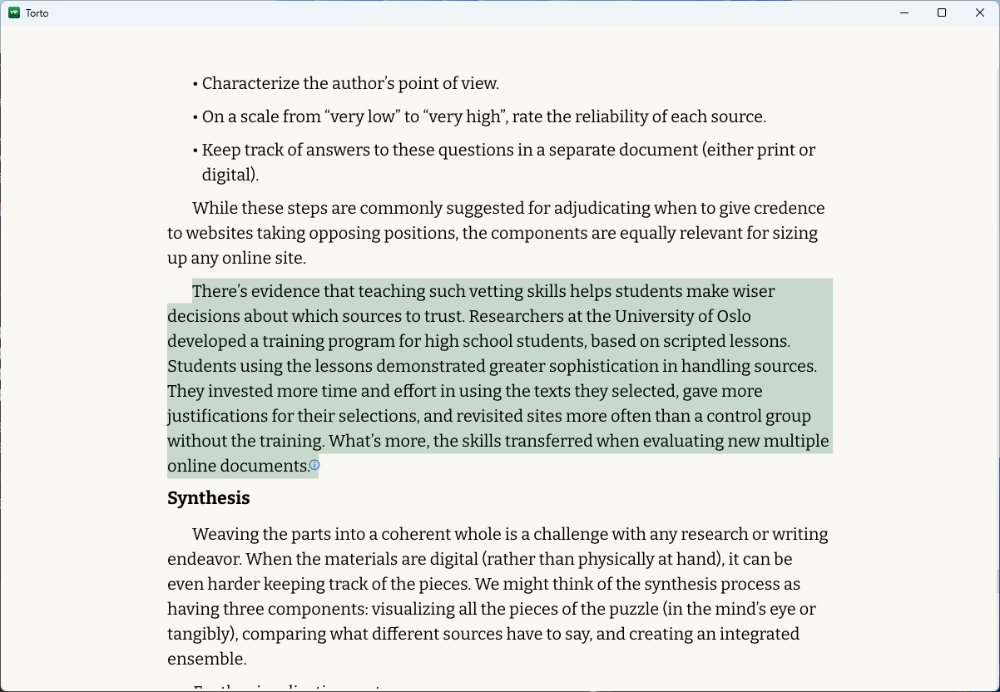

<p align="center">
  <strong>English</strong> · <a href="README.zh-CN.md">简体中文</a>
</p>

<p align="center">
  
</p>

<h1 id="torto" align="center">Torto</h1>

<p align="center">
  A focused, local-first ebook reader for Windows and macOS.<br>
  Native Rust rendering, no WebView, and your library stays under your control.
</p>

<p align="center">
  <a href="https://github.com/TortoTech/torto/releases/latest"></a>
  <a href="LICENSE"></a>
  
  
</p>

<p align="center">
  <a href="#features">Features</a> •
  <a href="#screenshots">Screenshots</a> •
  <a href="#download">Download</a> •
  <a href="#privacy">Privacy</a> •
  <a href="#development">Development</a> •
  <a href="#project-status">Project status</a> •
  <a href="#license">License</a>
</p>

## About

Torto is an open-source desktop reader for people who want their books to stay on their own computer. It combines a native bookshelf, flexible reading layouts, search and annotation tools, translation, an optional AI reading assistant, and direct WebDAV sync.

Unlike browser-based readers, Torto parses, lays out, paginates, and renders book content through a native Rust pipeline built on egui, Parley, Vello, and wgpu.

## Features

<div align="left">✅ Implemented</div>

| **Feature** | **Description** | **Status** |
| --- | --- | --- |
| **Multi-format support** | Read DRM-free EPUB, MOBI, AZW, AZW3/KF8, FB2, FBZ, CBZ, CHM, and PDF files. | ✅ |
| **Native rendering** | Parse, lay out, paginate, and render books with Rust instead of embedding a browser or WebView. | ✅ |
| **Page and scroll modes** | Switch between single-page, two-page, and chapter-based vertical scrolling layouts. | ✅ |
| **Library management** | Import books in bulk, display metadata and covers, search by title or author, and detect duplicates. | ✅ |
| **Navigation and search** | Use a hierarchical table of contents, chapter tracking, full-book search, keyboard navigation, mouse-wheel paging, and `F11` fullscreen. | ✅ |
| **Typography and themes** | Customize reading and interface fonts, font sizes, weight, layout, and Light or Dark themes. | ✅ |
| **Selection and annotations** | Select freely or by word, sentence, or paragraph; copy text, create highlights and notes, and return to durable source locations. | ✅ |
| **Image preview** | Open book images in an overlay, zoom with the wheel, pan when enlarged, and copy images to the clipboard. | ✅ |
| **Translation** | Translate book content in replacement or bilingual mode and translate the table of contents. | ✅ |
| **AI reading assistant** | Ask about the current book with source-backed citations and render Markdown, math, SVG, and Mermaid responses. | ✅ Optional |
| **WebDAV sync** | Sync books, reading progress, highlights, and notes directly through your own WebDAV provider. | ✅ Optional |
| **Windows updates** | Check GitHub Releases automatically, verify the MSI with SHA-256, and install updates after confirmation. | ✅ Windows |

## Screenshots

### Local bookshelf

Import books, browse covers, search by title or author, and continue where you left off.


### Focused reading

Keep the table of contents, reading surface, translation tools, and AI assistant close without letting them take over the page.



## Download

Download the latest build from [GitHub Releases](https://github.com/TortoTech/torto/releases/latest).

| **Platform** | **Package** | **Requirements** |
| --- | --- | --- |
| Windows | `Torto-*-x86_64.msi` | 64-bit Windows 10 or 11 |
| macOS, Apple silicon | `Torto-*-macos-arm64.dmg` | macOS 12 or later |
| macOS, Intel | `Torto-*-macos-x86_64.dmg` | macOS 12 or later |

After installation, import one or more books from the bookshelf. Use `←` / `→` or the mouse wheel to navigate, `Ctrl + F` to search the current book, and the reader menu to change layout, theme, translation, AI, and sync settings.

## Privacy

- Imported books and reading data remain in Torto's local application-data directory.
- WebDAV passwords and AI API keys are stored in the operating system's secure credential store rather than ordinary configuration files.
- AI and translation features are opt-in. Content is sent only when you configure and actively use a provider.
- WebDAV traffic goes directly from Torto to the service you choose; there is no Torto-operated relay.

## Development

Torto uses Rust `1.97.1`. The workspace package remains named `rebook-desktop`, while the shipped application is `Torto` (`torto.exe` on Windows).

```powershell
cargo run --locked -p rebook-desktop
cargo fmt --all --check
cargo clippy --workspace --all-targets --all-features -- -D warnings
cargo test --workspace
```

The core reading path is `parser → Reading IR → layout → renderer`. See the [native rendering architecture decision](docs/adr-0001-native-epub-renderer.md), [WebDAV sync protocol](docs/webdav-sync-v1.md), and [known upstream issues](docs/known-upstream-issues.md) for details.

## Project status

Torto is under active development. DRM-protected books are not supported. The native renderer intentionally does not aim for full browser-level HTML/CSS compatibility, so complex fixed layouts, vertical writing, Ruby annotations, and some interactive book content may not render completely yet.

Please report reproducible problems in [Issues](https://github.com/TortoTech/torto/issues). Include the book format, screenshots, and reproduction steps, but do not upload complete copyrighted books.

## License

Torto is available under the [MIT License](LICENSE).
